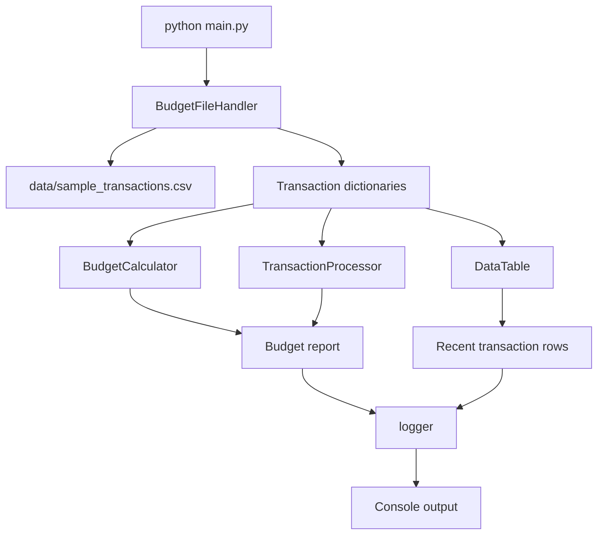

# Budget Buddy Architecture

Budget Buddy is a small Python command-line demo application for GH-300 GitHub Copilot training. It reads sample budget transactions, computes monthly budget metrics, formats a compact transaction table, and writes report output through a shared logger.

The app is intentionally starter-quality. Some TODOs, edge-case bugs, and refactoring opportunities are preserved as teaching material for Copilot-assisted development.

## Runtime Entry Point

[main.py](main.py) is the application entry point. Running `python main.py` starts the demo flow:

1. Create a fixed monthly budget value.
2. Read transactions from [data/sample_transactions.csv](data/sample_transactions.csv).
3. Build a budget report from the transactions.
4. Render recent transactions as a table.
5. Log summary metrics to the console.

## High-Level Flow

The standalone Mermaid source for this diagram is available in [architecture.mmd](architecture.mmd).



## Main Components

### Application Orchestration

[main.py](main.py) coordinates the application. It does not own low-level file loading, transaction grouping, or financial calculations. Instead, it composes the helper classes and controls the shape of the final report.

Key functions:

- `main()` runs the app.
- `build_report()` combines calculator and processor results into one dictionary.
- `show_transactions()` creates a `DataTable` and logs the current page of rows.
- `format_currency()` formats numeric values for display.

### File Access Layer

[file_handler.py](file_handler.py) contains `BudgetFileHandler`, which reads and writes budget data files relative to a configured base directory.

Responsibilities:

- Read transaction CSV files.
- Read transaction JSON files.
- Write report JSON files.
- Track processed filenames.
- Resolve file paths safely inside the configured base directory.

The handler now uses `_resolve_safe_path()` to block absolute paths and directory traversal attempts before opening files.

### Financial Calculation Layer

[calculator.py](calculator.py) contains `BudgetCalculator`, the financial math helper.

Responsibilities:

- Calculate total income.
- Calculate total expenses.
- Calculate net cash flow.
- Calculate remaining budget.
- Calculate average expense.
- Calculate category percentage.
- Calculate savings rate.
- Track calculation history.

This module intentionally still contains edge-case teaching opportunities, including division-by-zero behavior for empty or zero-value inputs.

### Transaction Processing Layer

[data_processor.py](data_processor.py) contains `TransactionProcessor`, which transforms and summarizes transaction dictionaries.

Responsibilities:

- Normalize category names.
- Filter transactions by month.
- Select expense transactions.
- Group expense totals by category.
- Find the largest expense.
- Detect probable duplicate transactions.
- Validate required transaction fields.

This module intentionally includes performance and validation gaps for workshop exercises.

### Table Presentation Helper

[data_table.py](data_table.py) contains `DataTable` and `ColumnDefinition`, a generic in-memory table helper.

Responsibilities:

- Read values from dictionaries or objects.
- Search rows across configured columns.
- Sort rows by sortable columns.
- Paginate rows.
- Format cell values with optional column formatters.
- Return page metadata for UI-style rendering.

In the current CLI app, `DataTable` is used only to show the first page of recent transactions.

### Logging

[logger.py](logger.py) configures the shared application logger.

Responsibilities:

- Configure console logging.
- Optionally configure file logging.
- Provide a shared `logger` instance named `github_copilot_demo`.

Project guidance prefers this logger over direct `print()` calls.

## Data Model

Transactions are represented as dictionaries with these expected fields:

| Field | Example | Purpose |
| --- | --- | --- |
| `date` | `2026-06-01` | Transaction date as a string. |
| `merchant` | `Grocery` | Merchant or source name. |
| `category` | `Groceries` | Budget category. |
| `amount` | `120.00` | Numeric transaction amount. |
| `type` | `expense` | Either income or expense. |

The CSV reader converts `amount` values to `float`. Other values remain strings.

## Report Shape

`build_report()` returns a dictionary with these keys:

| Key | Source |
| --- | --- |
| `monthly_budget` | Fixed value in `main()`. |
| `income` | `BudgetCalculator.total_income()`. |
| `expenses` | `BudgetCalculator.total_expenses()`. |
| `remaining_budget` | `BudgetCalculator.remaining_budget()`. |
| `net_cash_flow` | `BudgetCalculator.net_cash_flow()`. |
| `savings_rate` | `BudgetCalculator.savings_rate()`. |
| `largest_expense` | `TransactionProcessor.largest_expense()`. |
| `category_totals` | `TransactionProcessor.group_expenses_by_category()`. |

## Tests and Validation

Tests live under [tests](tests) and use pytest. The project is configured in [pytest.ini](pytest.ini) to run coverage by default.

Useful commands:

```powershell
python main.py
pytest
pytest --cov=. --cov-report=term-missing
```

The starter coverage threshold is intentionally low so learners can practice adding tests and improving confidence over time.

## Known Demo Gaps

Budget Buddy is not intended to be a production-grade budgeting system in its starter state. Current teaching surfaces include:

- Calculator edge cases around empty inputs and zero denominators.
- Permissive transaction validation.
- Inefficient transaction grouping and duplicate detection logic.
- Malformed CSV row handling.
- Missing TODO features listed in [INTENTIONAL_ISSUES.md](INTENTIONAL_ISSUES.md).

These gaps are part of the architecture story: the app is small enough to understand quickly, but realistic enough to demonstrate security review, refactoring, test generation, and agent-driven changes.