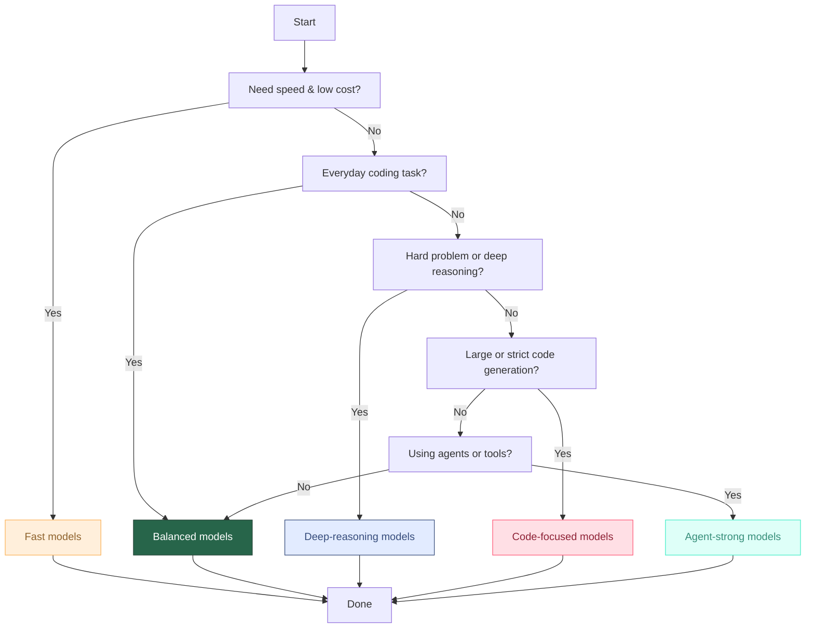

# 🔮 GitHub Copilot Model Selection Cheat Sheet

A simple, reliable guide for choosing the right model inside **GitHub Copilot** (Chat, Inline, or Agents).
---

### Disclaimer
Model availability depends on your Copilot plan and org settings.

---

---

## 🧭 Decision Flow

### 1️⃣ Do you need maximum speed and lowest cost?
➡️ **Use FAST models**

**Models**
- GPT-5 mini  
- Claude Haiku 4.5  
- Gemini Flash  

**Use when**
- You want quick answers
- You're summarizing, drafting, or doing simple refactors
- Low cost matters for large volumes of prompts

---

### 2️⃣ Do you need general, everyday coding assistance?
➡️ **Use BALANCED models**

**Models**
- GPT-4.1  
- Claude Sonnet 4 / 4.5  
- Gemini Pro  

**Use when**
- Writing code
- Debugging normal issues
- Explaining code
- Typical daily work

---

### 3️⃣ Are you dealing with a hard problem requiring deep reasoning?
➡️ **Use DEEP-REASONING models**

**Models**
- GPT-5 / 5.1 / 5.2  
- Claude Opus 4.5  
- Gemini 2.5 Pro  

**Use when**
- Multi-file reasoning
- Architecture-level analysis
- Tough bugs
- Complex logic or multi-step problems

---

### 4️⃣ Is the task code-first or code-heavy?
(refactoring, translating, generating large code blocks)

➡️ **Use CODE-FOCUSED models**

**Models**
- GPT-5 Codex  
- GPT-5.1 Codex  
- Codex Mini (preview)  

**Use when**
- Strict, deterministic code generation
- Large refactors
- Code migration across languages

---

### 5️⃣ Do you need multi-file edits, tools, or agent workflows?
➡️ **Use AGENT-STRONG models**

**Models**
- Claude Sonnet 4.5  
- GPT-4.1  
- GPT-5 series (if enabled)  

**Use when**
- Using GitHub Copilot Agents
- Multi-file refactoring
- Tool-based modifications
- Complex workflows

---

## 🗂️ Model Family Overview

| Category        | Best For                          | Models |
|-----------------|----------------------------------|--------|
| **FAST**        | Speed + low cost                 | GPT-5 mini, Claude Haiku 4.5, Gemini Flash |
| **BALANCED**    | Daily coding                     | GPT-4.1, Claude Sonnet 4 / 4.5, Gemini Pro |
| **DEEP-REASONING** | Complex problem solving     | GPT-5.x, Claude Opus 4.5, Gemini 2.5 Pro |
| **CODE-FOCUSED** | Deterministic, strict code     | GPT-5 Codex, GPT-5.1 Codex, Codex Mini |
| **AGENT-STRONG** | Multi-file, tool use, agents    | Claude Sonnet 4.5, GPT-4.1, GPT-5 |

---

## 🎯 Quick Recommendations

- **Most users, most of the time:** Claude Sonnet 4.5 or GPT-4.1  
- **Hard problems:** Claude Opus 4.5 or GPT-5.x  
- **Fast & cheap:** GPT-5 mini  
- **Strict coding:** GPT-5 Codex  
- **Agent workflows:** Claude Sonnet 4.5 or GPT-5  
